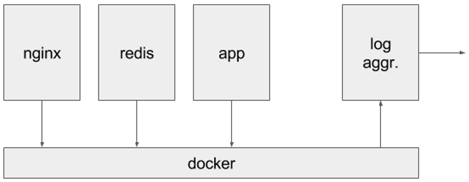

# Asyncio
## as a Western
## Dima Tisnek

# The Problem
https://12factor.net/logs

# Logs
A twelve-factor app never concerns itself with routing or storage of its output stream.

# Logs
Each process writes its event stream, unbuffered, to stdout.
* development — in terminal
* production — aggregated

# Demo time!

# The Good

# Python3.6
* this year

# Python3.6
* this year
* async generators

<section>
    <pre><code data-trim data-noescape>
async def foo():
    for i in range(3):
        yield i
        await asyncio.sleep(i)
    </code></pre>
</section>

# Python3.6
* this year
* async generators
* async comprehensions

<section>
    <pre><code data-trim data-noescape>
async def foo():
    return [await f() for f in xx if await c()]
</section>

# Demo time!

# The Bad

# The Bad
* interactive

# The Bad
* interactive
* unit tests

# The Bad
* interactive
* unit tests
* mocks

# The Ugly

# The Ugly
* Nothing
